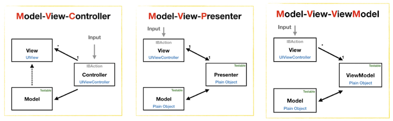

# RxSwift+MVVM 4시간에 끝내기
> RxSwift 4시간에 끝내기 (시즌2)

 

## Preface

요즘 관심이 높은 RxSwift!

[RxSwift](https://github.com/ReactiveX/RxSwift)는 Swift에 [ReactiveX](http://reactivex.io/)를 적용시켜 비동기 프로그래밍을 직관적으로 작성할 수 있도록 도와주는 **라이브러리**입니다. 

즉, RxSwift는 도구입니다. 하지만 높은 러닝커브에 쉽게 접근하지 못하는 분이 많습니다. 
도구를 이용하려고 배우고 노력하는 시간이 너무 큰 것은 배보다 배꼽이 더 큰 격입니다. 
RxSwift의 근본적인 학습 자체보다는, 빠르게 사용법을 익혀 프로젝트에 적용하는 것이 *현실주의 프로그래머들에게는* 더 중요합니다.

 

## Contents

### [1교시] 개념잡기 - RxSwift를 사용한 비동기 프로그래밍

1. Observable

   - Observable `create`
   - subscribe 로 데이터 사용
   - Disposable 로 작업 취소

2. Sugar API

   - 간단한 생성 : `just`, `from`
   - 필터링 : `filter`, `take`
   - 데이터 변형 : `map`, `flatMap`
   - 그 외 : [A Decision Tree of Observable Operators](http://reactivex.io/documentation/ko/operators.html)
   - Marble Diagram
     - [http://rxmarbles.com/](http://rxmarbles.com/)
     - [http://reactivex.io/documentation/operators.html](http://reactivex.io/documentation/operators.html)
     - [https://itunes.apple.com/us/app/rxmarbles/id1087272442?mt=8](https://itunes.apple.com/us/app/rxmarbles/id1087272442?mt=8)

 

### [2교시] RxSwift 활용하기 - 쓰레드의 활용과 메모리 관리

3. Observable Life-Cycle
   - Subscribed
   - Next
   - Completed / Error
   - Disposabled

4. 순환참조와 메모리 관리
   - Unfinished Observable / Memory Leak
   - (참조) [클로져와 메모리 해제 실험](https://iamchiwon.github.io/2018/08/13/closure-mem/)
	
5. 쓰레드 분기
   - DispatchQueue, OperationQueue
   - `observeOn`, `subscribeOn`

6. Stream의 분리 및 병합
   - `share`
   - `combine`, `merge`, `zip`

 

### [3교시] RxSwift 활용범위 넓히기 - UI 컴포넌트와의 연동

1. Subject
   - Data Control
   - Hot Observable / Cold Observable

2. RxCocoa
   - UI 작업의 특징
   - Observable / Driver
   - Subject / Relay

 

### [4교시] RxSwift 를 활용한 아키텍쳐 - 프로젝트에 MVVM 적용하기

1. MVVM 아키텍쳐
	- 어플리케이션 아키텍쳐 
     
        크게보기([MVC](docs/mvc.jpeg), [MVP](docs/mvp.jpeg), [MVVM](docs/mvvm.jpeg))
	- 왜 MVVM을 쓰는가?
	- MVVM과 RxSwift의 꿀조합

2. Refactoring to MVVM
3. MVVM-C
	- [Example](https://github.com/uptechteam/Coordinator-MVVM-Rx-Example)

 

## References

- [시즌1 자료 보기](README_s1.md)
- [카카오톡 RxSwift 오픈 채팅방](https://open.kakao.com/o/gl2YZjq)
- [Video] [RxSwift+MVVM 4시간에 끝내기 (시즌2)](https://www.youtube.com/watch?v=iHKBNYMWd5I) 
  

 

## License

 이 저작물은 <a rel="license" href="http://creativecommons.org/licenses/by/2.0/kr/">크리에이티브 커먼즈 저작자표시 2.0 대한민국 라이선스</a>에 따라 이용할 수 있습니다.

 
